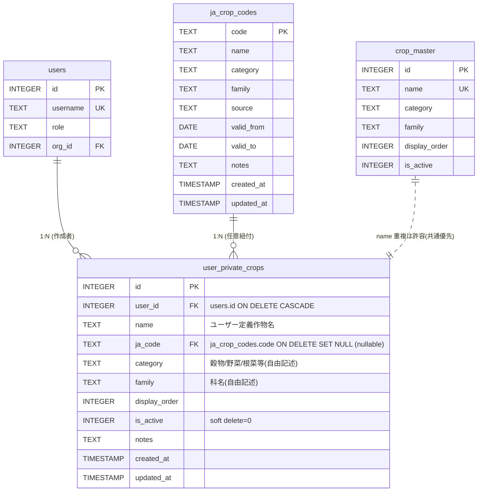

# rotation-planner ユーザ別作物追加機能 設計書 (cmd_579 Wave 1)

| 項目 | 内容 |
|---|---|
| cmd / subtask | cmd_579 / subtask_1245 |
| 作成日 | 2026-05-18T14:50 |
| 作成者 | 軍師 (gunshi) |
| 殿確定要件 | 1-a 完全プライベート / crop_master 残置 / 4-γ採択 / JA番号データは別cmd |
| Wave | 1 = 設計書(本書)・実装は殿承認後別Wave |
| 並行 | cmd_577 Wave 2g(復旧中)と独立並行 |

---

## §1 エグゼクティブサマリ (殿レビュー用・30行以内厳守)

**結論3行:**
1. **既存 `user_crops` (parent_crop_id+custom_name 派生モデル・現行APIで稼働中) は残置し、新規 `user_private_crops` テーブル+`ja_crop_codes` テーブルを別途新設**を推奨。殿要件文「user_crops.ja_code FK」を文字通り取ると既存テーブルへの ALTER ADD だが、parent_crop_id NOT NULL の SQLite ALTER 制約と概念混在を避けるため**別テーブル新設**が clean。
2. **5 つの新規API** (GET/POST/PATCH/DELETE `/api/user-private-crops` + GET `/api/ja-crop-codes/search`)・**row-level filter は WHERE user_id = current_user_id で完全プライベート**。`require_admin` でも他人閲覧不可(1-a要件)。
3. **migration は IF NOT EXISTS で新規2テーブル作成のみ・ALTER系不要**(既存 user_crops は触らない) → cmd_577 D3 schema diff 教訓を満たす最低リスク設計。

**選択肢:**
- 案α: 既存 user_crops に ALTER ADD column(parent_crop_id NOT NULL のままで概念混在)・スコア22/45
- **案β: 別テーブル `user_private_crops` 新設+既存 user_crops 放置 ★推奨** ・スコア36/45
- 案γ: 既存 user_crops DROP→CREATE+データ移行(既存API破壊リスク)・スコア24/45

**推奨:** 案β。実装影響=ER追加2本・新ルーター1ファイル・既存コード変更ゼロ・cmd_577並行進行可。

**殿への質問3問(必須):**
- **Q1':** テーブル名は **`user_private_crops`** で良いか? (殿要件文の「user_crops」は概念名で、既存テーブル名と区別する案・代替: `my_crops` / `user_crops_v2` / 既存への ALTER)
- **Q2':** **admin role でも他ユーザーの user_private_crops は閲覧不可** で良いか?(1-aと整合・JA職員 ja_staff も同様か?)
- **Q3':** **DELETE は hard / soft どちら**? (推奨=soft `is_active=0`・rollback容易+履歴監査可)

---

## §2 設計詳細

### §2.A ER図 (Mermaid)



### §2.B テーブル schema 定義 (冪等化済 SQL)

```sql
-- ════════════════════════════════════════════════════════════════
-- migrate_user_private_crops.sql
-- cmd_579 / subtask_1245 — 4-γ採択(殿確定 2026-05-18)
-- 冪等: 複数回実行可・既存テーブルは保護
-- ════════════════════════════════════════════════════════════════

-- 1. ja_crop_codes (JA作物番号マスタ・読取専用配信)
CREATE TABLE IF NOT EXISTS ja_crop_codes (
    code TEXT PRIMARY KEY,                     -- JA作物番号(後日紙電子化で投入・本cmdは枠のみ)
    name TEXT NOT NULL,                        -- JA表記名
    category TEXT,                             -- 用途分類
    family TEXT,                               -- 科名
    source TEXT,                               -- 出典(例: 'JA北海道 2026年版')
    valid_from DATE,
    valid_to DATE,
    notes TEXT,
    created_at TIMESTAMP DEFAULT CURRENT_TIMESTAMP,
    updated_at TIMESTAMP DEFAULT CURRENT_TIMESTAMP
);
CREATE INDEX IF NOT EXISTS idx_ja_crop_codes_name ON ja_crop_codes(name);
CREATE INDEX IF NOT EXISTS idx_ja_crop_codes_category ON ja_crop_codes(category);
CREATE INDEX IF NOT EXISTS idx_ja_crop_codes_valid ON ja_crop_codes(valid_from, valid_to);

-- 2. user_private_crops (ユーザー別プライベート作物)
CREATE TABLE IF NOT EXISTS user_private_crops (
    id INTEGER PRIMARY KEY AUTOINCREMENT,
    user_id INTEGER NOT NULL REFERENCES users(id) ON DELETE CASCADE,
    name TEXT NOT NULL,                                -- 作物名(ユーザー自由入力)
    ja_code TEXT REFERENCES ja_crop_codes(code) ON DELETE SET NULL,  -- 任意紐付け・空欄可
    category TEXT,                                     -- 自由記述
    family TEXT,                                       -- 自由記述
    display_order INTEGER DEFAULT 0,
    is_active INTEGER DEFAULT 1,                        -- soft delete: 0
    notes TEXT,
    created_at TIMESTAMP DEFAULT CURRENT_TIMESTAMP,
    updated_at TIMESTAMP DEFAULT CURRENT_TIMESTAMP,
    UNIQUE(user_id, name)                              -- 同一ユーザー内で名前重複禁止
);
CREATE INDEX IF NOT EXISTS idx_user_private_crops_user ON user_private_crops(user_id);
CREATE INDEX IF NOT EXISTS idx_user_private_crops_user_ja ON user_private_crops(user_id, ja_code);
CREATE INDEX IF NOT EXISTS idx_user_private_crops_active ON user_private_crops(user_id, is_active);

-- 3. 確認
SELECT '=== ja_crop_codes columns ===' AS info;
SELECT name FROM pragma_table_info('ja_crop_codes');
SELECT '=== user_private_crops columns ===' AS info;
SELECT name FROM pragma_table_info('user_private_crops');
```

**設計上の注意点:**
- `UNIQUE(user_id, name)`: 同一ユーザー内では同名作物の重複禁止(ホーリーバジルを2回登録できない)
- `ja_code` は **nullable**(殿要件「JA番号データは後日・任意入力空欄可」)
- `ja_code` の `ON DELETE SET NULL`: JA番号マスタの行が削除されても user_private_crops は孤立しない
- `user_id` の `ON DELETE CASCADE`: ユーザー削除時に user_private_crops も連鎖削除(代替=論理削除は §3 unknown #2 参照・殿質問にも追加検討)
- `is_active` で soft delete を実装(殿確認: Q3')

### §2.C API設計

| メソッド | エンドポイント | 認可 | 動作 |
|---|---|---|---|
| GET | `/api/user-private-crops` | JWT必須・本人のみ(`WHERE user_id=current_user.id`) | 本人の user_private_crops 一覧(is_active=1 デフォルト) |
| GET | `/api/user-private-crops/{id}` | JWT必須・本人のみ | 1件取得(他人 → 404) |
| POST | `/api/user-private-crops` | JWT必須・本人のみ | 新規作成(user_id 自動付与) |
| PATCH | `/api/user-private-crops/{id}` | JWT必須・本人のみ | 部分更新(他人 → 404) |
| DELETE | `/api/user-private-crops/{id}` | JWT必須・本人のみ | soft delete (`is_active=0`)・hard delete は別エンドポイント検討(Q3') |
| GET | `/api/ja-crop-codes/search?q=xxx&limit=50` | JWT必須・全ユーザー閲覧可 | JA作物番号 read-only検索(空q→全件) |
| GET | `/api/ja-crop-codes/{code}` | JWT必須・全ユーザー閲覧可 | JA作物番号1件取得 |

**Pydantic モデル (FastAPI):**

```python
# api/routers/user_private_crops.py (新規・既存 crops.py とは分離)

from fastapi import APIRouter, HTTPException, Depends
from pydantic import BaseModel, Field
from typing import Optional, List
from api.deps import get_current_user
from api.error_handlers import require_found

router = APIRouter(prefix="/api/user-private-crops", tags=["ユーザ別作物"])


class UserPrivateCropCreate(BaseModel):
    name: str = Field(..., min_length=1, max_length=100)
    ja_code: Optional[str] = None       # 任意・空欄可
    category: Optional[str] = None
    family: Optional[str] = None
    display_order: int = 0
    notes: Optional[str] = None


class UserPrivateCropUpdate(BaseModel):
    name: Optional[str] = Field(None, min_length=1, max_length=100)
    ja_code: Optional[str] = None
    category: Optional[str] = None
    family: Optional[str] = None
    display_order: Optional[int] = None
    is_active: Optional[int] = None      # 0=soft delete
    notes: Optional[str] = None


class UserPrivateCropResponse(BaseModel):
    id: int
    user_id: int
    name: str
    ja_code: Optional[str]
    category: Optional[str]
    family: Optional[str]
    display_order: int
    is_active: int
    notes: Optional[str]
    created_at: str
    updated_at: str


@router.get("", response_model=List[UserPrivateCropResponse])
def list_user_private_crops(
    active_only: bool = True,
    current_user: dict = Depends(get_current_user),
):
    """本人の作物一覧(他人不可視)"""
    return UserPrivateCropRepository.list_by_user(
        user_id=current_user["id"], active_only=active_only
    )


@router.post("", response_model=UserPrivateCropResponse, status_code=201)
def create_user_private_crop(
    req: UserPrivateCropCreate,
    current_user: dict = Depends(get_current_user),
):
    """本人作物の新規追加"""
    try:
        return UserPrivateCropRepository.create(
            user_id=current_user["id"], **req.dict()
        )
    except DuplicateKeyError:
        raise HTTPException(status_code=409, detail="同名作物が既に登録されています")


@router.get("/{crop_id}", response_model=UserPrivateCropResponse)
def get_user_private_crop(
    crop_id: int, current_user: dict = Depends(get_current_user)
):
    """本人作物1件取得"""
    crop = UserPrivateCropRepository.get_by_id_and_user(crop_id, current_user["id"])
    return require_found(crop, "user_private_crop")   # 他人なら 404


@router.patch("/{crop_id}", response_model=UserPrivateCropResponse)
def update_user_private_crop(
    crop_id: int,
    req: UserPrivateCropUpdate,
    current_user: dict = Depends(get_current_user),
):
    """本人作物の部分更新"""
    updated = UserPrivateCropRepository.update(
        crop_id, current_user["id"], **req.dict(exclude_unset=True)
    )
    return require_found(updated, "user_private_crop")


@router.delete("/{crop_id}", status_code=204)
def delete_user_private_crop(
    crop_id: int,
    hard: bool = False,
    current_user: dict = Depends(get_current_user),
):
    """本人作物の削除 (default=soft delete is_active=0・hard=Trueで hard delete)"""
    if hard:
        ok = UserPrivateCropRepository.hard_delete(crop_id, current_user["id"])
    else:
        ok = UserPrivateCropRepository.soft_delete(crop_id, current_user["id"])
    if not ok:
        raise HTTPException(status_code=404, detail="user_private_crop not found")
```

**JA作物番号 検索エンドポイント:**

```python
# 既存 api/routers/crops.py に追加 or 別 router

@router.get("/api/ja-crop-codes/search")
def search_ja_crop_codes(
    q: Optional[str] = None,
    limit: int = 50,
    current_user: dict = Depends(get_current_user),
):
    """JA作物番号検索(全ユーザー閲覧可・read-only)"""
    return JACropCodeRepository.search(q=q, limit=limit)


@router.get("/api/ja-crop-codes/{code}")
def get_ja_crop_code(
    code: str, current_user: dict = Depends(get_current_user)
):
    """JA作物番号1件取得"""
    record = JACropCodeRepository.get_by_code(code)
    return require_found(record, "ja_crop_code")
```

### §2.D 権限制御 (row-level filter)

**Repository層 (rotation_planner/common/db_access.py に追加):**

```python
class UserPrivateCropRepository:
    @staticmethod
    def list_by_user(user_id: int, active_only: bool = True) -> List[Dict]:
        """本人の作物のみ返す(row-level filter)"""
        with get_db() as conn:
            if active_only:
                cursor = conn.execute("""
                    SELECT * FROM user_private_crops
                    WHERE user_id = ? AND is_active = 1
                    ORDER BY display_order, name
                """, (user_id,))
            else:
                cursor = conn.execute("""
                    SELECT * FROM user_private_crops
                    WHERE user_id = ?
                    ORDER BY display_order, name
                """, (user_id,))
            return rows_to_list(cursor.fetchall())

    @staticmethod
    def get_by_id_and_user(crop_id: int, user_id: int) -> Optional[Dict]:
        """本人所有のみ取得・他人なら None"""
        with get_db() as conn:
            cursor = conn.execute("""
                SELECT * FROM user_private_crops
                WHERE id = ? AND user_id = ?
            """, (crop_id, user_id))
            row = cursor.fetchone()
            return row_to_dict(row) if row else None

    @staticmethod
    def create(user_id: int, name: str, ja_code: Optional[str] = None, **kwargs) -> Dict:
        """新規作成(user_id 強制付与)"""
        # ... INSERT 実装
```

**重要な認可ルール:**
- `WHERE user_id = current_user_id` を **全ての** read/write Repository メソッドに必ず含める
- `require_admin` でも他人の user_private_crops を **見えなくする** (Q2' YESの場合)
- JWT トークンから `current_user["id"]` を取り、SQL bind パラメータに必ず渡す(SQLインジェクション防御)

### §2.E migration 戦略 (cmd_577 D3 教訓を活かす)

**ファイル構成:**
```
scripts/migrate_user_private_crops.sql   # 冪等(IF NOT EXISTS で2新規テーブル)
scripts/apply_user_private_crops.sh       # bash wrapper(本cmdは新規テーブルのみなのでALTER不要)
```

**migrate_user_private_crops.sql 全文** → §2.B で記述済

**ensure_user_private_crops_tables() 関数 (db_access.py に追加):**

```python
def ensure_user_private_crops_tables():
    """
    user_private_crops と ja_crop_codes テーブルを冪等に作成する。
    cmd_577 subtask_1240 教訓: 「テーブル不在時のみCREATE」設計はALTERで上書きしない。
    本機能は新規テーブルのみ・既存テーブルは触らない → IF NOT EXISTS で安全。
    """
    with get_db() as conn:
        # ja_crop_codes
        conn.execute("""
            CREATE TABLE IF NOT EXISTS ja_crop_codes (
                code TEXT PRIMARY KEY, name TEXT NOT NULL, category TEXT, family TEXT,
                source TEXT, valid_from DATE, valid_to DATE, notes TEXT,
                created_at TIMESTAMP DEFAULT CURRENT_TIMESTAMP,
                updated_at TIMESTAMP DEFAULT CURRENT_TIMESTAMP
            )
        """)
        conn.execute("CREATE INDEX IF NOT EXISTS idx_ja_crop_codes_name ON ja_crop_codes(name)")
        conn.execute("CREATE INDEX IF NOT EXISTS idx_ja_crop_codes_category ON ja_crop_codes(category)")

        # user_private_crops
        conn.execute("""
            CREATE TABLE IF NOT EXISTS user_private_crops (
                id INTEGER PRIMARY KEY AUTOINCREMENT,
                user_id INTEGER NOT NULL REFERENCES users(id) ON DELETE CASCADE,
                name TEXT NOT NULL,
                ja_code TEXT REFERENCES ja_crop_codes(code) ON DELETE SET NULL,
                category TEXT, family TEXT,
                display_order INTEGER DEFAULT 0, is_active INTEGER DEFAULT 1, notes TEXT,
                created_at TIMESTAMP DEFAULT CURRENT_TIMESTAMP,
                updated_at TIMESTAMP DEFAULT CURRENT_TIMESTAMP,
                UNIQUE(user_id, name)
            )
        """)
        conn.execute("CREATE INDEX IF NOT EXISTS idx_user_private_crops_user ON user_private_crops(user_id)")
        conn.execute("CREATE INDEX IF NOT EXISTS idx_user_private_crops_user_ja ON user_private_crops(user_id, ja_code)")
        conn.execute("CREATE INDEX IF NOT EXISTS idx_user_private_crops_active ON user_private_crops(user_id, is_active)")

        conn.commit()
```

**lifespan への組込み (api/main.py):**

```python
@asynccontextmanager
async def lifespan(app):
    setup_api_logging()
    init_db()
    ensure_crop_tables()
    ensure_inventory_tables()
    ensure_user_private_crops_tables()    # ← 追加
    # ...
```

**db_schema.sql への統合:** 上記2テーブル定義を `db_schema.sql` 末尾にも追加(新規環境セットアップ時に init_db() が拾える)。

### §2.F React frontend 想定 (作物設定画面・本cmd実装範囲外だが見取り図)

- 既存「作物設定」ページに「**マイ作物**」セクションを追加
- 既存 crop_master(共通)とは別タブまたは別パネル
- JA番号入力: テキストボックス + JA作物番号検索ボタン → モーダルでJA作物番号一覧 → 選択で `ja_code` セット
- JA番号データ未投入時: 検索結果0件 → UI は「JA番号データ未登録」メッセージ表示 + 入力スキップ可

---

## §3 unknown_unknowns 10項目

1. **JA番号データ未投入時のUI挙動**: 検索エンドポイントが常に空配列を返す状態。フロントエンドは「JA番号データ未登録です」を表示し、`ja_code` 欄を非活性化 or 「後日入力可」プレースホルダで対応。
2. **ユーザー削除時の user_private_crops CASCADE**: `ON DELETE CASCADE` で物理削除。論理削除(`users.is_active=0` で残置) を採るなら `ON DELETE NO ACTION` に変更必要 → 殿質問追加候補。
3. **user_private_crops の export/import**: 別の v2 instance に持ち運ぶシナリオ(VPS引っ越し等)・CSV export機能を将来追加可。本cmdスコープ外。
4. **ja_code uniqueness**: 同一user内で同じ ja_code を複数作物に振れるか? 現設計は `UNIQUE(user_id, name)` のみで ja_code 重複は許容(同じJA番号を異なる名前で2登録可)・殿確認候補。
5. **crop_master との name重複**: 共通マスタ「てんさい」とユーザー追加「てんさい(うちの)」が存在する状況。輪作計画SQLが両方を JOIN するか・UI上でどう表示するか・現設計は **完全別扱い**(crop_master + user_private_crops を別 SELECT で UNION・UI上でprefix表示)。
6. **category / family の自由記述 vs マスタ参照**: 現設計は TEXT 自由記述。将来 crop_category / crop_family マスタを別テーブル化して FK化する可能性あり。本cmdスコープ外・YAGNI。
7. **is_active=0 の実装範囲**: 一覧 default は `is_active=1` のみ表示 (`active_only=True`)。輪作計画SQLからの参照時も is_active=1 限定が原則。past計画に紐付くuser_private_crop は削除不可にする等の参照整合性が必要(Q3'と関連)。
8. **多言語対応 i18n**: 現状 `name` は日本語のみ前提。将来 JA英語表記対応するなら `name_ja, name_en` 列追加 or 別テーブル(`crop_translations`)を検討。本cmdスコープ外。
9. **監査ログ**: 誰がいつ何を追加削除したかの履歴。現設計は `created_at / updated_at` のみで簡易。完全監査は別テーブル(`audit_log`)が必要・cmd_577 V4自動運転境界線と整合(別cmd起票候補)。
10. **パフォーマンス**: 1ユーザー最大 user_private_crops 件数想定 = 殿の経営規模(300株農家) なら 数十-数百作物想定 → 現 index設計 (user_id + (user_id, ja_code) + (user_id, is_active)) で十分。1万件超なら別途検討。

---

## §4 simplicity check 3問 (YAGNI遵守)

| # | 問い | 回答 |
|---|------|------|
| 1 | **このテーブル設計で過剰な列はないか?** | `notes` / `display_order` は薄いが頻出パターンで残す。`valid_from/valid_to` は ja_crop_codes に必要(JA番号は年度切替で失効するため・後日電子化cmdで活用)。**冗長性なし**。 |
| 2 | **このAPI設計で過剰なエンドポイントはないか?** | 5 + 2 = 7本。CRUD + ja_crop_codes 検索/取得 = 必要最小限。`PUT` を `PATCH` に統一(部分更新で十分・full replace 不要・YAGNI)。bulk endpoint (POST `/api/user-private-crops/bulk`) も将来必要時に追加・本cmd非範囲。**過剰なし**。 |
| 3 | **JA番号連携を最小機能で実装する場合、必要なテーブル/カラムは?** | `ja_crop_codes(code, name)` の **2列だけ**でも検索 + 紐付けは成立。category/family/source/valid_from/valid_to/notes は「後日紙電子化で投入する豊富データ」を受け入れる枠。**枠だけは現設計で確定し、後日 INSERT で埋める** → 殿要件「枠のみ・空欄可」と完全整合。 |

**結論: simplicity check 3問パス**(過剰列なし・過剰API なし・最小機能で枠は確定)

---

## §5 cmd_577 との衝突確認 (並行可能性評価)

### §5.1 現在の cmd_577 状況

- Wave 2g 完遂前(subtask_1244 復旧中 + 1236 スモーク blocked)
- Wave 2c 軍師戦略書(subtask_1224)で β2「別ディレクトリ並行構築」採択済
- subtask_1240 で全テーブル schema diff調査・ALTER 4件特定・冪等patch SQL 提供済

### §5.2 cmd_579 との並行可能性

| 観点 | 影響 | 並行可? |
|---|---|---|
| DB schema | 新規2テーブルのみ(IF NOT EXISTS)・既存触らない | ✅ 可能 |
| api/routers/ | 新規ファイル `user_private_crops.py` 1本追加・既存ファイル触らない | ✅ 可能 |
| lifespan | `ensure_user_private_crops_tables()` 1行追加 (api/main.py) | ⚠️ 微小衝突(同ファイル編集) — cmd_577 で同ファイルを触らないなら問題なし |
| db_schema.sql | 末尾に2テーブル追加 | ⚠️ 微小衝突(同ファイル編集) — マージ容易 |
| React frontend | 「作物設定」ページに「マイ作物」セクション追加 | ✅ 可能 |
| migration script | 新規 `scripts/migrate_user_private_crops.sql` 1本 | ✅ 可能 |
| ntripcaster | DB/コード変更のみ・実機操作なし | ✅ 影響ゼロ |

**結論: 並行可能** (微小衝突は git merge レベルで吸収可)

### §5.3 cmd_577 D3 schema diff 教訓の適用

| 教訓 (cmd_577 subtask_1240) | cmd_579 設計への反映 |
|---|---|
| `ensure_*()` は「テーブル不在時のみCREATE」で ALTER 非対応 | 本機能は **新規テーブルのみ・ALTER不要** → 問題ゼロ |
| HEAD db_schema.sql と migrate_*.sql の不同期 | 本機能 db_schema.sql + scripts/migrate_user_private_crops.sql + ensure_user_private_crops_tables() の **3点同期** を必須化 |
| PRAGMA table_info 検証必須 | 本機能 deploy 後の verify SQL を §付録C で提供 |
| _migration_log テーブル | `INSERT OR IGNORE INTO _migration_log VALUES ('user_private_crops_v1')` を migrate scriptに含める |

---

## §6 軍師戦略書 fix 項目反映 (5件目盲点追加)

cmd_577 戦略書(`docs/shogun/rotation_planner_v2_migration_strategy_20260518.md`)への追加fix提案。
従来の **4件** (subtask_1240 で§5に記述) に加え、**5件目の盲点** を本cmdで追加発見:

### §6.1 既存4件 (subtask_1240 既出)
1. **ALTER系 migration 考慮** (cmd_577 Wave 2e-3 crop_master.category 不在)
2. **`ensure_xxx_tables()` 設計確認** (テーブル不在時スキープ仕様の罠)
3. **VPS単独使用前提見直し** (Wave 2f-2 nginx衝突)
4. **認証source確認 — DB only vs file (users.json)** (Wave 2f / subtask_1244 重大発見)

### §6.2 新規 5件目 — `data dir 全ファイル網羅cp`

**発見背景:** cmd_577 subtask_1231 で軍師は「旧 app/data/ を新 app-v2/data/ に cp」と指示したが、これは **「DB ファイルだけが data dir にある」前提**だった。実機検証(subtask_1231 → 1244 復旧)で:
- `app/data/` 配下に **DB以外のファイル**(`settings.json`, `users.json`, `audit/*.log` 等)が存在する可能性
- `cp -r app/data` で全ファイル含めて移行されるが、**「DBだけ移行」と限定解釈すると file漏れ事故**

**fix提案:**

```
（旧 cmd_577戦略書 §5.2 subtask_1231 description）
DB cp + 配置 + lifespan init_db() による IF NOT EXISTS 適用

（新・差し替え）
data dir 全ファイル網羅cp + lifespan init_db() による IF NOT EXISTS 適用
  手順:
    1. cp -r app/data → app-v2/data (rsync -a で attributes 含む)
    2. ls -la app/data/ と app-v2/data/ を diff し1ファイルも漏れなしを確認
    3. find app/data -type f | wc -l と find app-v2/data -type f | wc -l が一致
    4. PRAGMA table_info で全テーブル列存在を verify (cmd_577 D3 §付録B)
```

### §6.3 6件目 (お針子のファイルレベル整合性チェック追加検討)

subtask_1244 で「DBだけcpすると settings.json/users.json漏れ」のような事故が発生した場合、**お針子の事後監査がファイルレベルまでチェックしていれば早期発見できた**。

**fix提案 (instructions/ohariko.md に追加検討項目):**

```
監査ルーブリック追加項目:
  ファイルレベル整合性 (3点):
  - data/ ディレクトリ全ファイル(DB以外)の cp 漏れ有無
  - 設定ファイル(settings.json / users.json / .env)の改変有無
  - audit log / cache ファイルの移行 or 切替判断
```

ただしこれは別cmdで採用判断 — 本cmd_579の実装スコープ外。本書では「fix項目として記録」のみ。

### §6.4 7件目 (cmd_579 本書から提案・schema/migrate/ensure 3点同期)

**発見背景:** cmd_577 subtask_1240 で「HEAD db_schema.sql と migrate_*.sql が同期していない(crop_master.category, inventory 8列が片方にしかない)」事象が判明。

**fix提案:** 任意の新テーブル/列追加時に **3点同期** を必須化:
1. `db_schema.sql` に CREATE TABLE / ALTER TABLE を反映
2. `scripts/migrate_xxx.sql` を冪等に作成・migrate_*.sql 群に追加
3. `rotation_planner/common/db_access.py` の `ensure_*()` 関数を更新

このルールを **CLAUDE.md** または **rotation-planner README** に明記。本書での提案・cmd_579 では本機能設計内で **3点同期済**(§2.B + §2.E)。

---

## 付録A. テーブル CREATE TABLE 文(完全版)

§2.B で記述済(冪等版 SQL)。

## 付録B. API リクエスト/レスポンス例

### POST `/api/user-private-crops` (新規追加)

**Request:**
```http
POST /api/user-private-crops HTTP/1.1
Authorization: Bearer <JWT>
Content-Type: application/json

{
  "name": "ホーリーバジル",
  "category": "ハーブ",
  "family": "シソ科",
  "display_order": 100
}
```

**Response (201 Created):**
```json
{
  "id": 42,
  "user_id": 7,
  "name": "ホーリーバジル",
  "ja_code": null,
  "category": "ハーブ",
  "family": "シソ科",
  "display_order": 100,
  "is_active": 1,
  "notes": null,
  "created_at": "2026-05-18T15:30:00",
  "updated_at": "2026-05-18T15:30:00"
}
```

### GET `/api/ja-crop-codes/search?q=てんさい`

**Response (200・JA番号データ未投入時):**
```json
[]
```

**Response (200・JA番号データ投入後):**
```json
[
  {
    "code": "JA-HKD-001",
    "name": "てんさい",
    "category": "根菜",
    "family": "アカザ科",
    "source": "JA北海道 2026年版",
    "valid_from": "2026-04-01",
    "valid_to": null,
    "notes": null,
    "created_at": "2026-06-01T00:00:00",
    "updated_at": "2026-06-01T00:00:00"
  }
]
```

## 付録C. verification SQL (deploy 後の冪等性確認)

```sql
-- 1. ja_crop_codes テーブルが存在
SELECT name FROM sqlite_master WHERE type='table' AND name='ja_crop_codes';

-- 2. user_private_crops テーブルが存在
SELECT name FROM sqlite_master WHERE type='table' AND name='user_private_crops';

-- 3. user_private_crops 必須列が存在
SELECT name FROM pragma_table_info('user_private_crops')
WHERE name IN ('id','user_id','name','ja_code','category','family','display_order','is_active','notes','created_at','updated_at');
-- → 11行返ること

-- 4. ja_crop_codes 必須列が存在
SELECT name FROM pragma_table_info('ja_crop_codes')
WHERE name IN ('code','name','category','family','source','valid_from','valid_to','notes','created_at','updated_at');
-- → 10行返ること

-- 5. インデックスが存在
SELECT name FROM sqlite_master WHERE type='index' AND name LIKE 'idx_user_private_crops_%';
-- → 3行 (user, user_ja, active)

SELECT name FROM sqlite_master WHERE type='index' AND name LIKE 'idx_ja_crop_codes_%';
-- → 3行 (name, category, valid)

-- 6. row-level filter のテスト (user_id=1 でログイン中の場合)
INSERT INTO user_private_crops (user_id, name) VALUES (1, 'test_crop');
SELECT * FROM user_private_crops WHERE user_id = 1;   -- → 1行
SELECT * FROM user_private_crops WHERE user_id = 2;   -- → 0行 (他人不可視)

-- 7. ja_code ON DELETE SET NULL の動作確認
INSERT INTO ja_crop_codes (code, name) VALUES ('TEST-001', 'テスト作物');
INSERT INTO user_private_crops (user_id, name, ja_code) VALUES (1, 'てすと', 'TEST-001');
DELETE FROM ja_crop_codes WHERE code = 'TEST-001';
SELECT ja_code FROM user_private_crops WHERE name = 'てすと';   -- → NULL
```

## 付録D. north_star_alignment

```yaml
north_star_alignment:
  status: aligned
  reason: |
    rotation-planner = 「農家を雑な事務作業から解放する道具」(殿memory)。
    殿の作物が共通マスタにない場合(ホーリーバジル等の特殊作物)、
    現状はリクエスト→開発側で crop_master 追加 という雑事務が必要。
    本機能で農家自身がプライベート作物を即追加できる → 殿の事務時間ゼロ化に貢献。
  risks_to_north_star:
    - "JA番号データ未投入で『枠だけある』状態 → 後日電子化cmd完了まで価値が半減 → 紙電子化cmdの優先度を明示化"
    - "他人作物が見えない設計 → JA職員/管理者が農家全体傾向把握できない → Q2'で殿確認"
    - "name自由記述で表記揺れ発生 (てんさい / 甜菜 / ビート) → 将来 normalize 機能が必要 → 別cmdで検討"
    - "輪作計画SQLが user_private_crops を参照する必要 → 別cmdで rotation-planner core への組込み設計"
    - "JA番号後日投入時に既登録の user_private_crops を後付け紐付け要 → 後日 PATCH UI が必要"
```

## 付録E. unknown_unknowns 補強 (軍師見落としの可能性)

1. **frontend の認証-API CORS問題**: 既存 CORS設定は localhost のみ・nginx同一オリジン化で回避できるが、未確認(cmd_577戦略書§2.6 参照)。
2. **既存 `/api/user-crops` (parent_crop_id 派生) と `/api/user-private-crops` (独立) の併存で UI混乱**: ルーター名前空間を分けても エンドユーザーには差が見えない・UX設計で「マイ作物」と「カスタム名(共通マスタリネーム)」を明確分離する必要。
3. **`ja_code` の glob pattern 検索**: `LIKE '%xxx%'` で index 効かない・将来 FTS5 化が必要なら本設計で考慮要(現状は数百件想定で問題なし)。
4. **同名作物の crop_master / user_private_crops 衝突時の優先順位**: 輪作SQL や UI で表示順を「crop_master 優先 / user_private_crops 優先 / 統合表示」のどれにするかは別cmdで設計判断 — 本cmdは「両方を別 SELECT で取得し UI で UNION 表示」を前提とする。

---

(本書 EOF)
