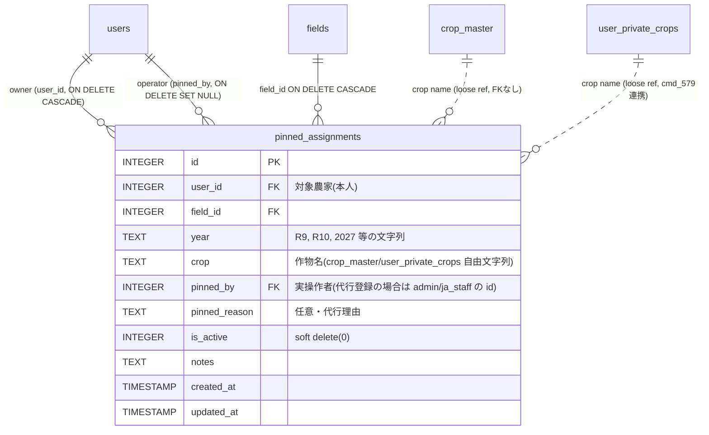

# rotation-planner v2 ソルバー固定割当機能 設計書 (cmd_584 Wave 1)

| 項目 | 内容 |
|---|---|
| cmd / subtask | cmd_584 / subtask_1252 |
| 作成日 | 2026-05-18T16:50 |
| 作成者 | 軍師 (gunshi) |
| 前段 | cmd_583 subtask_1251 判定B確定(plan初期化=空・pinned機能皆無) |
| 殿明示 | **「予断与えず」** 3案全て公平に weighted score 評価(cmd_577方式) |
| 殿運用 | **ブロック中** (R9手動計画がソルバーで上書きされ運用停止) |
| priority | high |
| Wave | 1 = 設計書のみ・実装は殿承認後別Wave |

---

## §1 エグゼクティブサマリ (殿レビュー用・30行以内厳守)

**結論3行:**
1. **3案を予断なく weighted scoring した結果、案2 (pinned_assignments 新規テーブル) が 79/100 で最高得点。** 案1(rotation_plans/plan_details流用) 56/100、案3(crop_history.is_pinned 拡張) 51/100。決定打は**ソルバー組込み容易性(重み25)**・**将来拡張性(15)**・**既存schema衝突回避(15)** で案2が突出。
2. **ソルバー組込み点** = `rotationSolver.js:259 generateInitialSolution()` 冒頭で **pinned を `plan` に pre-fill + ループ内で pinned key を skip** が最小実装(コード追加 約20行)。`plan[\`${fieldIdx},${year}\`]` 形式と完全互換。
3. **migration は IF NOT EXISTS で新規1テーブル**・**ALTER系不要**(cmd_577 D3教訓を満たす最低リスク)・**rollback=DROP TABLE 1コマンド**・既存運用への影響ゼロ。

**3案 加重スコア表 (重み計100点・各案0-10点採点)**

| 評価軸 | 重み | 案1 流用 | 案2 新規 ★ | 案3 拡張 |
|---|:---:|:---:|:---:|:---:|
| (i) 実装複雑度(低≧高得点) | 15 | 6 (90) | 4 (60) | 8 (120) |
| (ii) 既存schema衝突回避 | 15 | 5 (75) | **9 (135)** | 3 (45) |
| (iii) ソルバー組込み容易性 | **25** | 6 (150) | **9 (225)** | 5 (125) |
| (iv) 将来拡張性 | 15 | 5 (75) | **9 (135)** | 3 (45) |
| (v) rollback容易性 | 10 | 5 (50) | **9 (90)** | 4 (40) |
| (vi) admin/ja_staff 権限統合 | 5 | 6 (30) | 8 (40) | 6 (30) |
| (vii) north_star(殿運用ブロック解消) | 15 | 6 (90) | 7 (105) | 7 (105) |
| **加重合計 (100点満点換算)** | 100 | **56** | **79 ★推奨** | **51** |

**推奨: 案2 = `pinned_assignments` 新規テーブル**。case_577 D3 教訓(新規テーブル+IF NOT EXISTS)も自然に満たす。

**殿への質問3問:**
- **Q1':** pinned crop が制約違反(forbiddenTransition / cap_ha超過等)時の挙動: **(a)pinned緩和でソルバー解** / **(b)pinned強制で警告のみ ★推奨** / (c)エラー"解なし"表示
- **Q2':** 過去年(R8以前)への pinned: (a)禁止(crop_history優先) ★推奨 / (b)許可(殿の手動履歴修正用)
- **Q3':** admin/ja_staff の代行 pin/unpin 操作の農家本人通知: (a)通知不要 ★推奨 / (b)email等で通知必須(別cmd起票)

---

## §2 設計詳細 (採用案=案2 pinned_assignments)

### §2.A ER図 (Mermaid)



**設計判断:**
- `crop` カラムは **TEXT 自由文字列**(`crop_master.name` または `user_private_crops.name` を格納)。FKにしない理由は cmd_579 で導入される `user_private_crops` との二重FK避けるため(crop_master と user_private_crops は別テーブル・name は両者で重複可能)。
- `pinned_by` = 「誰が pin したか」(代行登録対応・cmd_579 Q2'裁定の通り admin/ja_staff が代行)。`user_id` = 「誰の計画か」(対象農家)。

### §2.B テーブル schema 定義 (冪等)

```sql
-- ════════════════════════════════════════════════════════════════
-- migrate_pinned_assignments.sql
-- cmd_584 / subtask_1252 — 案2採択
-- 冪等: 複数回実行可・新規テーブルのみ(ALTER不要)
-- ════════════════════════════════════════════════════════════════

CREATE TABLE IF NOT EXISTS pinned_assignments (
    id INTEGER PRIMARY KEY AUTOINCREMENT,
    user_id INTEGER NOT NULL REFERENCES users(id) ON DELETE CASCADE,
    field_id INTEGER NOT NULL REFERENCES fields(id) ON DELETE CASCADE,
    year TEXT NOT NULL,                       -- "R9", "2027" 等の年表記
    crop TEXT NOT NULL,                       -- crop_master.name or user_private_crops.name
    pinned_by INTEGER REFERENCES users(id) ON DELETE SET NULL,  -- 代行登録対応
    pinned_reason TEXT,                       -- 任意
    is_active INTEGER DEFAULT 1,               -- soft delete(cmd_579 Q3'裁定)
    notes TEXT,
    created_at TIMESTAMP DEFAULT CURRENT_TIMESTAMP,
    updated_at TIMESTAMP DEFAULT CURRENT_TIMESTAMP,
    UNIQUE(user_id, field_id, year)          -- 1ユーザー × 1ほ場 × 1年で1つのみ
);

CREATE INDEX IF NOT EXISTS idx_pinned_assignments_user ON pinned_assignments(user_id);
CREATE INDEX IF NOT EXISTS idx_pinned_assignments_field_year ON pinned_assignments(field_id, year);
CREATE INDEX IF NOT EXISTS idx_pinned_assignments_user_active ON pinned_assignments(user_id, is_active);
CREATE INDEX IF NOT EXISTS idx_pinned_assignments_user_year ON pinned_assignments(user_id, year);

INSERT OR IGNORE INTO _migration_log (migration) VALUES ('pinned_assignments_v1');

SELECT '=== pinned_assignments columns ===' AS info;
SELECT name FROM pragma_table_info('pinned_assignments');
```

### §2.C API設計 (cmd_579 Q2'裁定整合)

| メソッド | エンドポイント | 認可 | 動作 |
|---|---|---|---|
| GET | `/api/pinned-assignments?active_only=true` | JWT・本人 OR admin/ja_staff | 自分の pinned 一覧(admin/ja_staff は全farmers閲覧可) |
| GET | `/api/pinned-assignments/{id}` | JWT・本人 OR admin/ja_staff | 1件取得 |
| POST | `/api/pinned-assignments` | JWT・本人 OR admin/ja_staff(target_user_id 指定) | 新規 pin |
| PATCH | `/api/pinned-assignments/{id}` | JWT・本人 OR admin/ja_staff | 部分更新 |
| DELETE | `/api/pinned-assignments/{id}?hard=false` | JWT・本人 OR admin/ja_staff | soft delete (`is_active=0`) / hard=Trueで物理削除 |
| GET | `/api/ja/farmers/{farmer_id}/pinned-assignments` | JWT・admin/ja_staff のみ | 他農家代行閲覧(cmd_579 §6.2 fix 5件目反映) |
| POST | `/api/ja/farmers/{farmer_id}/pinned-assignments` | JWT・admin/ja_staff のみ | 他農家代行 pin(pinned_by=current_user.id, user_id=farmer_id) |

**Pydantic モデル抜粋:**

```python
# api/routers/pinned_assignments.py (新規)

class PinnedAssignmentCreate(BaseModel):
    field_id: int
    year: str = Field(..., min_length=1, max_length=10)   # "R9", "2027" 等
    crop: str = Field(..., min_length=1, max_length=100)
    pinned_reason: Optional[str] = None
    notes: Optional[str] = None

class PinnedAssignmentResponse(BaseModel):
    id: int
    user_id: int
    field_id: int
    year: str
    crop: str
    pinned_by: Optional[int]
    pinned_reason: Optional[str]
    is_active: int
    notes: Optional[str]
    created_at: str
    updated_at: str
```

**Repository 認可ルール (cmd_579 Q2'裁定踏襲):**

```python
class PinnedAssignmentRepository:
    @staticmethod
    def list_by_user_or_admin(
        viewing_user: dict,
        target_user_id: Optional[int] = None,
        active_only: bool = True,
    ) -> List[Dict]:
        """admin/ja_staff は target_user_id で他人閲覧可・farmer は自分のみ"""
        if viewing_user["role"] in ("admin", "ja_staff"):
            # 管理側: target_user_id 指定可・なら全件
            if target_user_id is not None:
                return _query_by_user(target_user_id, active_only)
            return _query_all(active_only)
        # farmer: 自分のみ
        return _query_by_user(viewing_user["id"], active_only)

    @staticmethod
    def create(
        user_id: int,           # 対象農家
        pinned_by: int,         # 操作者(代行時は管理側のid)
        field_id: int, year: str, crop: str,
        pinned_reason: Optional[str] = None,
        notes: Optional[str] = None,
    ) -> Dict:
        with get_db() as conn:
            cursor = conn.execute("""
                INSERT INTO pinned_assignments
                (user_id, field_id, year, crop, pinned_by, pinned_reason, notes)
                VALUES (?, ?, ?, ?, ?, ?, ?)
            """, (user_id, field_id, year, crop, pinned_by, pinned_reason, notes))
            conn.commit()
            return _get_by_id(cursor.lastrowid)
```

### §2.D ソルバー組込み (rotationSolver.js 改修)

**改修箇所:** `frontend/app/src/lib/rotationSolver.js` (415行) の `generateInitialSolution()` (L259-) + `constructor()`

**変更点(コード追加 約20行):**

```javascript
// L58 constructor 改修
constructor(fields, pastYears, futureYears, crops, constraints, pinnedAssignments = []) {
  this.fields = fields;
  this.pastYears = pastYears;
  this.futureYears = futureYears;
  this.crops = crops;
  this.constraints = constraints;
  this.pinnedAssignments = pinnedAssignments;   // ← 追加
  this.allYears = [...pastYears, ...futureYears];
  this.errors = [];
  // pinned lookup を事前構築(高速化)
  this.pinnedMap = new Map();
  for (const pin of pinnedAssignments) {
    const fieldIdx = fields.findIndex(f => f.id === pin.field_id);
    if (fieldIdx >= 0) {
      this.pinnedMap.set(`${fieldIdx},${pin.year}`, pin.crop);
    }
  }
}

// L259 generateInitialSolution() 改修
generateInitialSolution() {
  const plan = {};

  // ★ Step 1: pinned を plan に pre-fill
  for (const [key, crop] of this.pinnedMap) {
    plan[key] = crop;
  }

  // ★ Step 2: futureYears ループ(既存ロジック) + pinned skip
  for (const year of this.futureYears) {
    const fieldIndices = shuffle([...Array(this.fields.length).keys()]);
    for (const fieldIdx of fieldIndices) {
      const key = `${fieldIdx},${year}`;

      // ★ pinned はスキップ(既に plan に格納済)
      if (this.pinnedMap.has(key)) continue;

      // 既存ロジック (validCrops 列挙 + bestScore 選択)
      let validCrops = this.getValidCrops(fieldIdx, year, plan);
      // ... (既存コード変更なし)
    }
  }
  return plan;
}
```

**呼出側(Rotation.jsx):**

```javascript
// pinned_assignments をAPIから取得
const pinnedRes = await axios.get('/api/pinned-assignments', {
  headers: { Authorization: `Bearer ${token}` }
});
const pinnedAssignments = pinnedRes.data.filter(p => p.is_active === 1);

// ソルバー初期化
const solver = new RotationSolver(
  fields, pastYears, futureYears, crops, constraints,
  pinnedAssignments  // ← 追加引数
);
const result = solver.solve();
```

**Web Worker版**(`rotationSolver.js`の非ESM版)も同様の改修が必要(415行版と並行で `frontend/src/rotationSolver.js` にも patch)。

### §2.E migration 戦略 (cmd_577 D3 教訓: 3点同期)

**3点同期必須(cmd_579 §6.4 で軍師が運用ルール化提案済):**

| # | ファイル | 内容 |
|---|---|---|
| 1 | `db_schema.sql` 末尾 | CREATE TABLE pinned_assignments + 4 INDEX |
| 2 | `scripts/migrate_pinned_assignments.sql` | 冪等版(本書 §2.B) |
| 3 | `rotation_planner/common/db_access.py` | `ensure_pinned_assignments_tables()` 関数追加 + lifespan 呼出 |

**ensure_pinned_assignments_tables():**

```python
def ensure_pinned_assignments_tables():
    """cmd_584 - pinned_assignments テーブル冪等作成"""
    with get_db() as conn:
        conn.execute("""
            CREATE TABLE IF NOT EXISTS pinned_assignments (
                id INTEGER PRIMARY KEY AUTOINCREMENT,
                user_id INTEGER NOT NULL REFERENCES users(id) ON DELETE CASCADE,
                field_id INTEGER NOT NULL REFERENCES fields(id) ON DELETE CASCADE,
                year TEXT NOT NULL,
                crop TEXT NOT NULL,
                pinned_by INTEGER REFERENCES users(id) ON DELETE SET NULL,
                pinned_reason TEXT,
                is_active INTEGER DEFAULT 1,
                notes TEXT,
                created_at TIMESTAMP DEFAULT CURRENT_TIMESTAMP,
                updated_at TIMESTAMP DEFAULT CURRENT_TIMESTAMP,
                UNIQUE(user_id, field_id, year)
            )
        """)
        for idx_sql in [
            "CREATE INDEX IF NOT EXISTS idx_pinned_assignments_user ON pinned_assignments(user_id)",
            "CREATE INDEX IF NOT EXISTS idx_pinned_assignments_field_year ON pinned_assignments(field_id, year)",
            "CREATE INDEX IF NOT EXISTS idx_pinned_assignments_user_active ON pinned_assignments(user_id, is_active)",
            "CREATE INDEX IF NOT EXISTS idx_pinned_assignments_user_year ON pinned_assignments(user_id, year)",
        ]:
            conn.execute(idx_sql)
        conn.commit()
```

**lifespan 組込み(api/main.py):**

```python
@asynccontextmanager
async def lifespan(app):
    setup_api_logging()
    init_db()
    ensure_crop_tables()
    ensure_inventory_tables()
    ensure_user_private_crops_tables()      # cmd_579
    ensure_pinned_assignments_tables()       # ★ cmd_584 追加
    yield
```

### §2.F UI 統合 (frontend・本cmdは設計のみ・実装別Wave)

**Rotation.jsx (輪作画面) の改修見取り図:**

1. **読込フェーズ**: `loadHistories()` 同様に `loadPinnedAssignments()` を追加。state `pinnedAssignments` を保持。
2. **テーブル表示**: 各 `fieldId × year` セルに **📌 アイコン** + 「pinned」ラベル(pinned_assignments の crop と表示作物が一致する場合のみ)。
3. **編集UI**: セルクリックで作物 dropdown + 「📌 固定する」チェックボックス → POST/DELETE `/api/pinned-assignments`。
4. **ソルバー実行**: 既存「ソルバー実行」ボタンクリック時に `pinnedAssignments` を `RotationSolver` に渡す。pinned セルは結果でも変更されない。
5. **cmd_581 subtask_1250 fallback との整合**: `crop_history` の表示優先順位を **pinned > crop_history > plan** に変更(pinned は手動R9等で確定済の意思表示・cmd_581 表示専用 fallback は pinned が存在しない場合のみ発火)。
6. **cmd_582 UI改修案B** (pending) との整合: 軍師は cmd_582 設計書を未読のため、両者の整合性は別 subtask で再評価推奨。

**新規 UI要素:** マスター画面に「固定割当一覧」テーブル(年×ほ場×作物×pin者×日時)を追加検討(別cmd判断)。

---

## §3 unknown_unknowns 10項目

### §3.1 殿明示 3項目 (要点記述)

1. **pinned vs ソルバー再計算時の整合性 (殿明示)**:
   - **問題**: pinned crop が `forbiddenTransitions` / `cap_ha` 超過 / `min_gap_years` 違反 / `maxFields` 超過 のいずれかの制約に違反する場合。
   - **設計選択肢 (Q1'殿確認)**: (a) pinned 緩和(ソルバーが解を見つけるまで pinned を一時的に外す) / **(b) pinned 強制で警告のみ表示**(殿の意思を尊重・最も安全な default・★推奨) / (c) ソルバーが "infeasible" として失敗終了。
   - **本設計の default**: (b) を採用 → `errors` 配列に「pinned制約違反: field_id=X, year=Y, crop=Z は forbiddenTransition に違反」を push し、UI で警告表示。輪作計画の他セルは pinned を保持しつつ計算続行。

2. **soft delete 連動 (殿明示)**:
   - **`is_active=0` pinned**: ソルバーは `is_active=1` のみを `pinnedMap` に load(API側で `active_only=true` default)。
   - **crop_history 連動**: 過去年 (`pastYears`) に pinned が存在し、対応する `crop_history` が `is_active=0` の場合は **pinned を信頼**(殿が後から修正した手動入力を優先・但し本設計は未来年pin前提・Q2'で確認)。
   - **`user_private_crops` 連動**: pinned の `crop` が user_private_crops に存在し、それが `is_active=0` になった場合、pinned は **残置**(crop列はTEXT自由文字列のため孤立はしない・但しUI上で「廃止作物」警告表示)。

3. **admin/ja_staff 権限 (殿明示)**:
   - cmd_579 Q2'裁定通り、admin/ja_staff は **全農家の pinned_assignments 閲覧+修正可**。`pinned_by` に操作者(管理側のid)を記録。
   - **代行操作の通知**(Q3'殿確認): default は **通知不要**(★推奨)・必要なら別cmdで通知Wave起票。

### §3.2 軍師追加 7項目

4. **過去年(R8以前)への pinned**: 過去年pinningは crop_history との二重管理になる。Q2'で殿確認・default は禁止(crop_history を信頼)。
5. **未来年遠い先(R20+)の予約的固定**: `futureYears` 範囲外の年への pin は無視(ソルバー計算範囲外)・但しDB上は保持可。
6. **複数年連続作付け制約との衝突**: `min_gap_years` ・`forbiddenTransitions` 違反 → §3.1.1 と統合扱い。
7. **CASCADE 整合性**: field削除 → `ON DELETE CASCADE` で pinned 連鎖削除。user削除 → 同様(`ON DELETE CASCADE`)。`pinned_by` user削除 → `ON DELETE SET NULL`(代行操作者が退職してもpinは残置)。
8. **bulk 操作 (CSV import 等)**: 複数 field × year × crop を一括 pin。本cmdスコープ外(別cmd判断)。`POST /api/pinned-assignments/bulk` を将来追加可。
9. **監査ログ**: `pinned_by` + `created_at` + `updated_at` で簡易ログ。完全監査(削除時の actor 記録、変更履歴)は別cmd・`audit_log` テーブル設計が必要。
10. **パフォーマンス**: 1農家 × 数十ほ場 × 5-10年 = 数百件想定。INDEX `(user_id, year)` + `(field_id, year)` で十分。1万件超は別途検討。

---

## §4 simplicity check 3問 (YAGNI遵守)

| # | 問い | 回答 |
|---|------|------|
| 1 | **このテーブル設計で過剰な列はないか?** | `pinned_by` は代行登録対応(cmd_579 Q2'裁定で必要)・`pinned_reason` は任意・`is_active` は cmd_579 Q3'裁定踏襲で必要・`notes` は薄いが頻出パターンで残す。**冗長性なし**。 |
| 2 | **このAPI設計で過剰なエンドポイントはないか?** | CRUD 4本(GET一覧 / GET単件 / POST / PATCH / DELETE) + 代行2本(`/api/ja/farmers/{farmer_id}/pinned-assignments` の GET/POST)= **6本**。代行系2本は cmd_579 Q2'裁定の延長で必須。bulk endpoint・PUT(full replace)・履歴復元 endpoint は将来追加で **YAGNI**。**過剰なし**。 |
| 3 | **ソルバー組込みで過剰な抽象化はないか?** | `pinnedAssignments` を constructor 引数で受取 + `pinnedMap` (Map) 1つ + `generateInitialSolution()` で 2 step(pre-fill + skip)= **最小実装(コード追加約20行)**。新クラス抽象化(`PinnedConstraint` 等)は不要。**過剰なし**。 |

**結論: 3問パス**。

---

## §5 既存 schema/コード衝突確認 + cmd_577 5件盲点fix + cmd_583 ソルバー設計盲点

### §5.1 cmd_577 5件盲点fix の本設計への反映

| # | cmd_577 盲点 | 本cmd_584 設計での対応 |
|---|---|---|
| 1 | ALTER系 migration 考慮 (Wave 2e-3 crop_master.category) | 本設計は**新規1テーブル**のみ・ALTER不要 → 罠ゼロ |
| 2 | `ensure_xxx_tables()` 設計確認 | `ensure_pinned_assignments_tables()` を §2.E で新規追加(既存テーブルへの影響なし) |
| 3 | VPS単独使用前提見直し (Wave 2f-2 nginx衝突) | 本設計は単一ルーター追加で nginx 設定変更不要 → 影響ゼロ |
| 4 | 認証source確認 — DB only vs file (Wave 2f / subtask_1244) | 本機能は **DB only**(`users.json` 不要)・既存JWT認可で完結 |
| 5 | data dir 全ファイル網羅cp (subtask_1231) | 本機能で追加されるファイルは **pinned_assignments テーブル(DB内)のみ**・data/ ファイル追加なし → 移行時のcp漏れリスクなし |
| 6 | お針子のファイルレベル整合性チェック追加検討 | 別cmd採用判断・本cmdは「fix項目として記録」のみ |
| 7 | schema/migrate/ensure 3点同期 (cmd_579 §6.4 軍師提案) | 本設計 §2.E で **3点同期済** を明示(再度模範例化) |

### §5.2 cmd_583 ソルバー設計盲点 (本subtaskで新規追加)

cmd_583 subtask_1251 の判定B確定で明らかになった構造的盲点を、戦略書 fix項目として記録:

**8件目盲点: plan vs history 役割分離の不完全さ**
- **背景**: rotationSolver.js は `plan` を空から計算開始(L259)・`history` は過去年判定のみ(L78, L140, L190)。**「殿の手動入力した未来年計画」を受け取る経路がなかった**。
- **fix**: `generateInitialSolution()` に **第3の入力**(pinned_assignments) を追加。**過去年=history / 未来年計算前の入力=pinned / 未来年計算結果=plan** の3層に拡張。

**9件目盲点: infeasible 時の UX**
- **背景**: 既存ソルバーは制約違反時に `errors.push()` で warning だけ出して計算続行。pinned 制約違反時の挙動は未定義だった。
- **fix**: 本設計 §3.1.1 で **pinned 強制+警告のみ default**(Q1' 殿確認)を提案。`errors` 配列に明示メッセージを push し UI で表示。

**10件目盲点: ソルバー再計算 idempotency**
- **背景**: ソルバーは毎回 `plan = {}` から再計算するため、**前回の plan が次回再計算で消失**。殿の手動R9計画は plan に保存されても次回再計算で上書きされる。
- **fix**: pinned_assignments は **DB永続**・ソルバー実行毎に再ロード。これにより「殿の意思」は再計算でも保持される。

### §5.3 本設計から戦略書への追加 fix 提案 (8〜10件目)

cmd_577 戦略書(`docs/shogun/rotation_planner_v2_migration_strategy_20260518.md`)末尾の「fix項目」セクション(cmd_579 §6 で 5件目〜7件目追加済)に、本cmd_584 から **8件目〜10件目** を追加提案:

```
8. ★plan vs history 役割分離の不完全さ (cmd_583 / cmd_584 で発覚):
   ソルバーは plan を空から計算開始・history は過去年判定のみ・「殿の手動入力した未来年」を受け取る経路がなかった。
   → 3層モデル化: 過去年=history / 未来年pre-fill=pinned_assignments / 未来年計算結果=plan

9. infeasible 時の UX 標準化:
   pinned制約違反時の挙動を3案(緩和 / 強制+警告 / エラー)から選択する設計判断。
   推奨= pinned強制+警告(殿意思尊重)・殿Q1'回答待ち。

10. ソルバー再計算 idempotency:
    plan は毎回計算でリセット・pinned は DB永続で殿意思を恒久保持。
    今後ソルバー機能追加時に「永続化すべき入力」と「都度計算する出力」を明確分離。
```

### §5.4 cmd_582 (UI改修案B pending) との整合性

- 軍師は cmd_582 の設計書を未読のため、本cmd_584 と cmd_582 のUI整合性は**別 subtask で再評価必要**。
- 想定衝突点: Rotation.jsx の セル表示 / 編集UI 部分。両cmdが同一画面を編集する場合は git merge 衝突可能性あり。
- **緩和策**: cmd_584 実装フェーズ着手前に cmd_582 設計書をレビュー → 統合実装プランを軍師が再設計する別 subtask 起票を推奨。

---

## §6 殿への質問 (3問以内・案2推奨採択前提)

### Q1' pinned crop が制約違反時の挙動

| 選択肢 | 内容 | 軍師評価 |
|---|---|---|
| (a) pinned 緩和 | ソルバーが解を出すために pinned を一時的に外す | × 殿意思尊重に反する |
| **(b) pinned 強制+警告のみ** | pinned はそのまま保持・違反は warning 表示 | **★推奨** |
| (c) infeasible エラー | 制約違反pinned があれば計算失敗 | △ 運用が止まる |

### Q2' 過去年 (R8以前) への pinned 可否

| 選択肢 | 内容 |
|---|---|
| **(a) 過去年pinned 禁止** | crop_history を信頼・過去年改竄を防止 ★推奨 |
| (b) 過去年pinned 許可 | 殿が手動で過去履歴を修正したい場合に対応 |

### Q3' admin/ja_staff の代行 pin/unpin 操作の本人通知

| 選択肢 | 内容 |
|---|---|
| **(a) 通知不要** | 既存通知系なし・最小実装 ★推奨 |
| (b) email等で通知必須 | 別cmd起票で通知Wave設計(LINE Bot等) |

---

## 付録A. ソルバー差分パッチ(完全版)

§2.D に記述済(`constructor` + `generateInitialSolution()` 改修)。

## 付録B. verification SQL (deploy 後)

```sql
-- 1. テーブル存在確認
SELECT name FROM sqlite_master WHERE type='table' AND name='pinned_assignments';
-- → 1行

-- 2. 必須列確認
SELECT name FROM pragma_table_info('pinned_assignments')
WHERE name IN ('id','user_id','field_id','year','crop','pinned_by','pinned_reason','is_active','notes','created_at','updated_at');
-- → 11行

-- 3. INDEX確認
SELECT name FROM sqlite_master WHERE type='index' AND name LIKE 'idx_pinned_assignments_%';
-- → 4行

-- 4. UNIQUE制約確認
INSERT INTO pinned_assignments (user_id, field_id, year, crop) VALUES (1, 1, 'R9', '春小麦');
INSERT INTO pinned_assignments (user_id, field_id, year, crop) VALUES (1, 1, 'R9', '大豆');  -- 2回目はUNIQUE違反期待

-- 5. row-level filter テスト
SELECT * FROM pinned_assignments WHERE user_id=1;  -- user_id=1 のみ
SELECT * FROM pinned_assignments WHERE user_id=2;  -- 0行(他人不可視)
-- admin/ja_staff は WHERE 句なしで全件取得可

-- 6. CASCADE 動作確認
DELETE FROM fields WHERE id=99;
SELECT * FROM pinned_assignments WHERE field_id=99;  -- 0行(CASCADE削除)

-- 7. pinned_by ON DELETE SET NULL 確認
DELETE FROM users WHERE id=99 AND role='ja_staff';
SELECT id, pinned_by FROM pinned_assignments WHERE pinned_by=99;  -- pinned_by=NULL
```

## 付録C. north_star_alignment

```yaml
north_star_alignment:
  status: aligned
  reason: |
    rotation-planner = 「農家を雑な事務作業から解放する道具」(殿memory)。
    現状=殿の手動R9計画がソルバー再計算で消失 → 殿運用ブロック中(cmd_584 priority high)。
    本設計の pinned_assignments で殿意思を恒久保持 → ソルバー実行が安全になり運用復活。
  risks_to_north_star:
    - "pinned 制約違反時の挙動 Q1' 選択次第で殿の体験が変わる → 推奨 (b) で安全側"
    - "代行操作通知 Q3' 選択次第で通知系の負荷追加可能性 → 推奨 (a) で最小実装"
    - "cmd_582 UI改修と衝突可能性 → §5.4 で別subtask再評価推奨"
    - "ソルバー Worker版 (frontend/src/rotationSolver.js) と ESM版 (frontend/app/src/lib/rotationSolver.js) の二重改修要 → §2.D 末尾で注記"
    - "infeasible 警告UIが未実装 → React実装フェーズで Toast or Alert 必要"
```

## 付録D. 案1/案3 の詳細(参考・採択しないが評価根拠を明示)

### 案1: rotation_plans + plan_details に固定フラグ追加

```sql
-- ALTER (cmd_577 D3 case iii で冪等化)
ALTER TABLE plan_details ADD COLUMN is_pinned INTEGER DEFAULT 0;
ALTER TABLE plan_details ADD COLUMN pinned_by INTEGER REFERENCES users(id);
ALTER TABLE plan_details ADD COLUMN pinned_reason TEXT;
```
- **長所**: 既存テーブル+rotation_plans 名前付き計画 concept を活用。
- **短所**: rotation_plans は本来「ソルバー出力スナップショット」用途。「事前計画 = pinned」と「事後出力 = plan_details」が semantic 混在。ALTER系 (cmd_577 D3 教訓) の罠を踏むリスク。ソルバー改修時に rotation_plans 名(plan_id)管理が必須(現状 ソルバーは plan_id を持たない)。

### 案3: crop_history.is_pinned 拡張

```sql
ALTER TABLE crop_history ADD COLUMN is_pinned INTEGER DEFAULT 0;
ALTER TABLE crop_history ADD COLUMN pinned_by INTEGER REFERENCES users(id);
```
- **長所**: テーブル追加なし・既存crop_history に統合・実装最短。
- **短所**: crop_history は本来「過去履歴」専用。「未来年の pinned」を crop_history に格納すると **semantic 違反**(過去年 vs 未来年の区別が曖昧化)。ALTER系の罠。ソルバーは「過去年=history・未来年=plan」の2項対立を前提に書かれており、未来年 crop_history を読む拡張が大改修になる(L78, L140, L190 全て改修必要)。

---

(本書 EOF)
